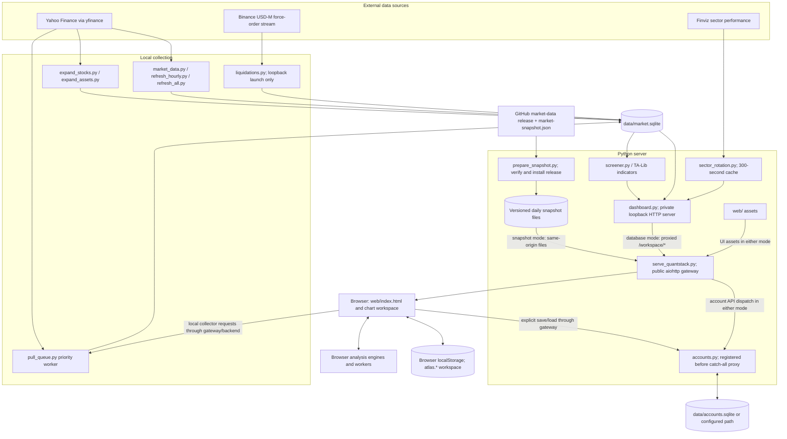
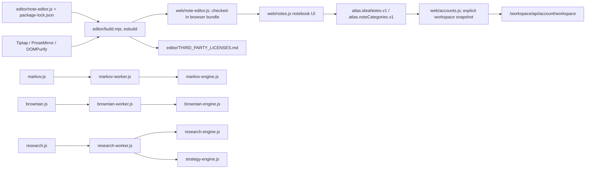
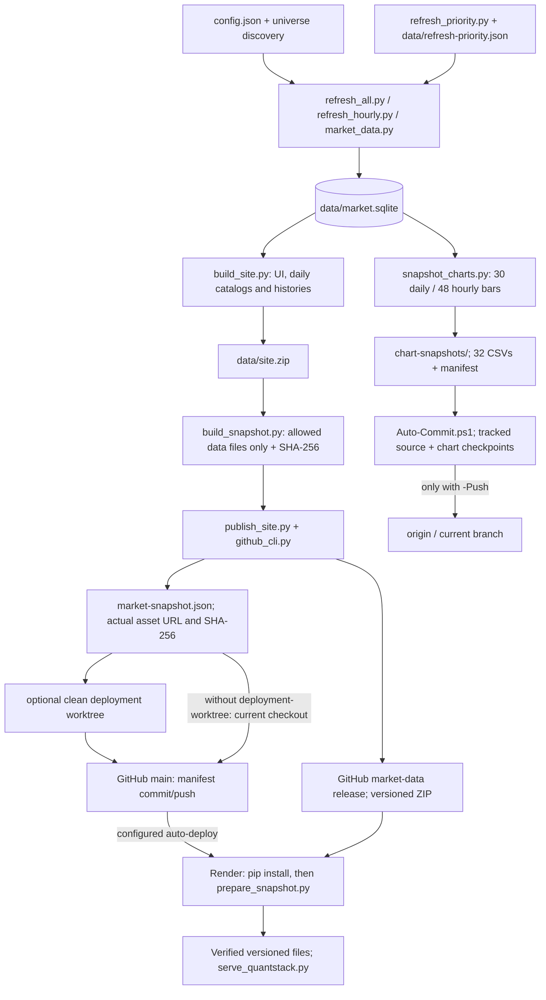
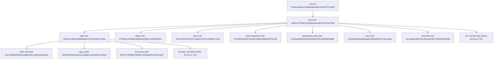

# QuantStack project map

Inspected on 2026-10-11 (Asia/Taipei). Repository: `hsiantw/QuantStack`.

This map is anchored to commit **`765eba42baccc390ebdde44fb515c6b227c1b859`**. The committed inventory contains **14,978 files** and **2,011 directory-tree entries including the root**. Counts describe paths in this revision, not unique deduplicated Git objects. At inspection, `market-snapshot.json` had an uncommitted change; that change and these newly created documentation files are outside this commit's hashes.

The architecture below describes checked-in code and configuration. It does not assert which revision Render currently runs or which Windows tasks are installed. Relationships were checked against Python imports, server routing, HTML script loading, worker imports, storage definitions, and PowerShell entrypoints. Existing prose documentation was secondary where it differed from code.

- [Complete readable tracked-file tree](project-tree.txt): every non-`.venv` tracked file; `.venv` is collapsed with its exact count.
- [Complete Git object inventory](project-git-objects.tsv): every directory and file, including `.venv`, with mode, object ID, and logical blob size. No file or database contents are included.

## 1. Running application

Arrows show data delivery or the explicitly labeled call. The two market-data paths are alternatives selected when the server starts.



Precise routing is in [serve_quantstack.py](../serve_quantstack.py):

1. `serve()` starts the priority-pull worker and checks `data/market.sqlite`. `has_market_data()` returns true when either `prices` or `intraday_prices` has rows; SQLite errors return false.
2. With stored prices, the gateway strips `/workspace` and proxies workspace traffic to `dashboard.Handler` on `127.0.0.1:<ephemeral port>`.
3. Without stored prices, `prepare()` installs the pinned release. The gateway serves current `web/` assets plus snapshot files and injects `static-data.js` before `app.js`. The dashboard thread still starts, but snapshot market requests use files rather than its API.
4. This mode is fixed at startup. Provisioning a database does not switch a running snapshot server automatically.
5. `/` redirects to `/workspace/`, preserving other query parameters but removing `research`. `/workspace` redirects to `/workspace/`. Routes outside the workspace return 404, apart from the root redirect.
6. Accounts have an earlier explicit route and work independently of the market-data mode, subject to their origin/access configuration.
7. Default bind is `127.0.0.1:8501`; `PORT` or `--port` changes the port. Render's start command binds `0.0.0.0`.
8. Liquidation collection starts only when the launch host is `127.0.0.1`, `localhost`, or `::1`. Captured events are partial Binance venue data, not complete market liquidation totals.

## 2. Browser modules and build boundary

The chart uses native canvas and plain JavaScript. `index.html` loads ordered classic scripts sharing chart state. There is no separate frontend framework server in this serving path.

| Responsibility | Files under `web/` |
|---|---|
| Document, initialization, data loading, base chart and price table | `index.html`, `app.js`, `style.css` |
| Layout, docks, workspace controls | `workspace.js`, `workspace.css` |
| Appearance, comparisons, date navigation, image export, fullscreen, right-click menu | `terminal.js`, `terminal.css` |
| Price/time scaling, pan/zoom, reset view | `chart-scale.js`, `chart-scale.css` |
| Drawing objects, editing, undo/redo | `drawings.js` |
| Basic studies and server indicator-library integration | `indicators.js`, `indicators.css` |
| Favorites, watchlists, sorting and context actions | `watchlists.js`, `watchlists.css` |
| Local enrollment and requested data pulls | `data-pulls.js` |
| Screener UI | `screener.js`, `screener.css` |
| Browser strategy/backtest calculations and UI | `strategy-engine.js`, `strategy.js` |
| Markov calculations, worker and UI | `markov-engine.js`, `markov-worker.js`, `markov.js`, `markov.css` |
| Brownian calculations, worker and UI | `brownian-engine.js`, `brownian-worker.js`, `brownian.js` |
| Return/risk calculations and UI | `risk-engine.js`, `risk.js` |
| Portfolio, pairs, options, forecasting, market overview and other research tools | `research-engine.js`, `research-worker.js`, `research.js`, `research.css` |
| Notebook controls, categories, checklists and rich-text editing | `notes.js`, generated `note-editor.js` |
| Registration/login and explicit account workspace save/load | `accounts.js` |
| Shared palette and theme selection | `theme.js`, `theme.css` |
| Hosted/static daily-data adapter | `static-data.js` |
| Separate interview-preparation document with its own notes/theme code | `interview-prep.html` |

All **39** files under `web/` are represented above.



`editor/` has six committed files: editor source, build script, `package.json`, lockfile, README, and dependency licenses. Node is used to rebuild the editor bundle; the checked-in Render build command installs Python dependencies and uses the existing bundle. Browser notes save locally; account synchronization is an explicit user action, not continuous background synchronization. `accounts.js` snapshots `atlas.*` keys. The interview-preparation page's separate storage keys also use this prefix.

## 3. API surface

The public gateway prefix is `/workspace`. `dashboard.py` itself sees the suffix routes shown below. Running `dashboard.py` directly uses port 8765 by default and omits the gateway's account routes.

| Public path | Methods | Handler and behavior |
|---|---|---|
| `/workspace/api/symbols` | GET | `dashboard.catalog()`; configured assets plus collected data |
| `/workspace/api/history` | GET | `dashboard.history()`; price bars, interval/date filtering |
| `/workspace/api/export` | GET | History as CSV |
| `/workspace/api/screener` | GET | `screener.snapshot()` and expansion status |
| `/workspace/api/usage` | GET | `dashboard.api_usage()` |
| `/workspace/api/indicators` | GET | Available indicator definitions |
| `/workspace/api/indicator` | GET | Calculated indicator values; TA-Lib/custom logic |
| `/workspace/api/liquidations` | GET | Locally recorded liquidation buckets |
| `/workspace/api/sector-rotation` | GET | Cached Finviz sector snapshot |
| `/workspace/api/local-scheduler` | GET, POST | Local status and symbol enrollment; local access checks |
| `/workspace/api/pull-queue` | GET, POST | Local queue status and new requests; local access checks |
| `/workspace/api/account/session` | GET | `accounts.py`; session state |
| `/workspace/api/account/register`, `/login`, `/logout` | POST | `accounts.py`; account/session changes (all have the same full account prefix) |
| `/workspace/api/account/workspace` | GET, POST | Versioned personal workspace load/save |

In snapshot mode, the market API routes above are **not proxied**. `static-data.js` implements the browser data adapter by fetching `symbols.json`, `screener.json`, and `prices/<encoded-symbol>.json.gz`. It decompresses prices in the browser and aggregates daily data into weekly/monthly bars. Accounts continue through the gateway's separate API. The full server indicator library, hourly data, collector controls, liquidation capture, and live sector panel are local features; basic browser calculations remain available on daily snapshots.

## 4. Storage boundaries

| Store | Content / ownership | Git and deployment relationship |
|---|---|---|
| `data/market.sqlite` | `prices`, `state`, `attempts`, `membership`, `intraday_prices`, `intraday_state`, `crypto_exchange_prices`, `liquidation_events`, `liquidation_collector_state`, `api_requests`; `expand_stocks.py` adds `stock_metadata`, `stock_enrichment` | Local database; absent from this Git snapshot; daily data is exported for hosting |
| `data/pull-queue.sqlite` | `requests` table; queued/running/complete/failed priority pulls | Separate local queue database |
| `data/accounts.sqlite` | `accounts`, `sessions`, `auth_limits`; workspace JSON and revision live in the `accounts` row | Separate account database; path overridable with `QUANTSTACK_ACCOUNTS_DB`; excluded from release archives |
| Browser `localStorage` | `atlas.*` chart state, drawings, watchlists, notes, research/settings; account revision bookkeeping uses `quantstack.*` | Per browser/origin; explicit save/load can transfer workspace state to the configured account server |
| `data/exports/` | Per-symbol CSV exports from `market_data.export()` | Local generated output |
| `data/*refresh*.json`, expansion reports and logs | Collection status, priorities and progress | Local generated operational state |
| `site/`, `data/site.zip` | Portable UI plus daily datasets from `build_site.py` | Generated staging/preview output |
| `data/market-data-<hash16>.zip` | Data-only archive from `build_snapshot.py` | Uploaded as a release asset |
| `market-snapshot.json` | Release URL, SHA-256 and snapshot metadata | Tracked deployment manifest; currently modified locally at inspection |
| `QuantStack-main/static/market-data/<hash16>/` | Verified `symbols.json`, `screener.json`, `snapshot.json`, compressed daily histories and `.complete` marker | Generated installation/cache directory; actively used despite its location under the legacy source folder |
| `chart-snapshots/` | 16 daily CSV buckets + 16 hourly CSV buckets + `manifest.json` | 33 tracked files; latest 30 daily and 48 hourly bars per symbol; bounded checkpoint, not full-history backup |
| Root `users.db` | Preserved legacy database | **Tracked** at this revision; not the new account store and not served by the current gateway. Its contents were not inspected. |

The account database stores password hashes and token hashes, not plaintext credentials. `QUANTSTACK_PUBLIC_ORIGIN` controls the configured HTTPS origin. Without that configuration or a secure request, account access is restricted to the local computer. The checked-in free Render service does not provision durable account storage; this map does not assume a disk or environment variables have been configured externally.

`crypto_source_rows()` / `ingest_crypto_sources()` retain code for Coinbase, Kraken, Bitstamp and Gemini BTC minute candles, and the schema can hold those rows. The current scheduled `market_data.py intraday` path dispatches to `refresh_hourly.refresh()`; the retained exchange collectors should not be read as scheduled live feeds.

## 5. Collection, publication and automation



`prepare_snapshot.py` verifies SHA-256, checks allowed archive names and required catalogs, limits expanded size, and installs under the hash-derived directory. `build_snapshot.py` excludes UI and account databases from the release package. `snapshot_catalog.py` merges configured assets into hosted catalogs and marks assets without daily history unavailable rather than inventing quotes.

| Entry point | Exact responsibility in code |
|---|---|
| `market_data.py sync` | Daily collection and CSV export; can publish when `deployment.json` exists and `--local-only` is absent |
| `market_data.py intraday` | Dispatches to `refresh_hourly.refresh()` |
| `refresh_hourly.py` | Bounded hourly history updates, priority ordering, progress/reporting and queued pulls |
| `refresh_all.py` | Concurrent daily/hourly catch-up; `--daily-only` omits hourly jobs; ranks configured/popular/US cap-volume leaders and supports same-run resume |
| `refresh_priority.py` | Prioritizes due symbols from a bounded list while retaining oldest-attempt rotation |
| `expand_stocks.py`, `expand_assets.py` | Universe/history/metadata expansion helpers |
| `local_scheduler.py` | Resource profiles, local access checks, enrollment and status; does not itself install Windows tasks |
| `pull_queue.py` | Durable priority requests and daemon worker; collectors use `data/ingestion.lock` |
| `Install-Schedule.ps1` | Defines `MarketData-DailySync` at 09:00 machine-local time; runs `Refresh-And-Publish.ps1`; four-hour task limit |
| `Refresh-And-Publish.ps1` | Runs `refresh_all.py --daily-only --workers 2`, then publishes successful new data via `../market-data-render-deploy` |
| `Install-Intraday-Schedule.ps1` | Defines hourly `MarketData-IntradaySync` running `market_data.py intraday`; 15-minute task limit |
| `Install-Update-Automation.ps1` | Defines the same hourly task name using `refresh_hourly.py --profile low/high` with a 55-minute limit; also defines `QuantStack-AutoCommit` at 09:30 Asia/Taipei |
| `Auto-Commit.ps1` | Exports bounded chart CSVs, stages those plus tracked changes, commits a checkpoint; pushes only if invoked with `-Push`; guards against staged work and in-progress Git operations |
| `Update-Charts.ps1` / `.bat` | Manual hourly update with selected resource profile |
| `Start-LocalSite.ps1` / `Preview-Local.bat` / `Run-Local-Website.bat` | Local combined app preview; chooses a working Python environment |
| `Start-Dashboard.ps1` | Direct dashboard-only launcher at port 8765 |
| `run_quantstack.bat`, `start.sh`, `Procfile`, `render.yaml` | Launch the unified server; shell/Render entrypoints use `--host 0.0.0.0` |

Both hourly installers register `MarketData-IntradaySync` with `-Force`; they are alternative definitions, and the installer last run determines the actual task configuration. Installed task state was not queried. The older README text describing daily collection as local-only with a short budget differs from the current daily installer/wrapper shown above.

## 6. Repository boundaries and preserved material

| Tracked area | Files | Logical bytes in committed blobs | Meaning |
|---|---:|---:|---|
| Root files | 101 | 649,075 | Runtime, scripts, manifests, tests, documentation, legacy database |
| `web/` | 39 | 1,167,212 | Current browser application |
| `editor/` | 6 | 131,984 | Reproducible notebook editor source/build metadata |
| `docs/` | 5 | 28,676 | Existing design/integration notes at the pinned commit; this new map is additional |
| `chart-snapshots/` | 33 | 61,258,848 | Bounded daily/hourly data checkpoints |
| `QuantStack-main/` | 76 | 1,798,580 | Retired Streamlit source, utilities, docs, static and attached assets |
| `.streamlit/` | 1 | 72 | Preserved Streamlit configuration |
| `.venv/` | 14,717 | 423,302,562 | Tracked Python environment contents |
| **Total** | **14,978** | **488,337,009** | Logical sum by file path; not compressed repository size |

There are **29 `test_*.py` files** and **19 `smoke_*.py` files** at the root. These are test-file counts, not executed test-case counts. Their exact names appear in the tree. No test suite was run for this documentation-only inspection. `.github/` exists locally but contains no workflow files at inspection and contributes no paths to the pinned Git tree.

`QuantStack-main/app.py`, its 27 `pages/*.py` files, and 25 `utils/*.py` files are retained legacy implementation. [LEGACY.md](../QuantStack-main/LEGACY.md) and the current launcher confirm the Streamlit app is not launched or served. The runtime snapshot cache nested below its `static/` directory is a separate active use of that directory.

The filesystem also has `.venv-integration/`, `editor/node_modules/`, `.test-tmp/`, `__pycache__/`, `data/`, `site/`, `.git/` and local `deployment.json`. They are not part of the committed inventory shown here. `.venv/` is already tracked even though `.gitignore` names it; ignore rules do not retroactively remove tracked entries.

At inspection, `git worktree list` also reported these sibling checkouts of the same repository (they are not subdirectories of `QuantStack/`):

| Directory beside `QuantStack/` | Branch | Observed commit |
|---|---|---|
| `buyer-fraud-render-deploy/` | `deploy/buyer-fraud-prep-20261011` | `cf3aa648080289fa9063f5c369555d1684ba332a` |
| `crypto-watchlist-deploy/` | `fix/hosted-crypto-watchlist` | `e8be5f7c0c2c725ba1307481b1dd855d9a592457` |
| `market-data-render-deploy/` | `deploy/market-data-refresh` | `da8f8564c8266f9210e880abf68129ec2eea2134` |

Those branch tips are observations, not proof of the deployed Render revision.

## 7. Actual Git Merkle structure

The architectural diagrams above explain responsibilities. Git also supplies a real content-addressed Merkle structure for this exact committed state. This repository uses **SHA-1 Git object IDs**; the deployment ZIP checksum is a separate **SHA-256** value.



A blob ID hashes the Git object header and file bytes. A tree ID hashes its encoded child entries (file modes, names and object IDs). Thus changing a tracked file changes its blob ID and ancestor tree IDs when committed. A commit references the root tree plus parent/history and commit metadata; the commit ID and root tree ID are different. The diagram expands representative leaves; the TSV contains every leaf and directory entry, including all dependencies. A directory listing alone is not a cryptographic proof.

Reproduce the committed inventory without touching the working files:

```powershell
git rev-parse '765eba42baccc390ebdde44fb515c6b227c1b859^{tree}'
git ls-tree -r -t --long 765eba42baccc390ebdde44fb515c6b227c1b859
git show 765eba42baccc390ebdde44fb515c6b227c1b859:serve_quantstack.py
```

The root-tree hash covers only that commit. It excludes current database contents, installed scheduler state, ignored generated files, remote release bytes, local modifications, and these newly generated map files.
